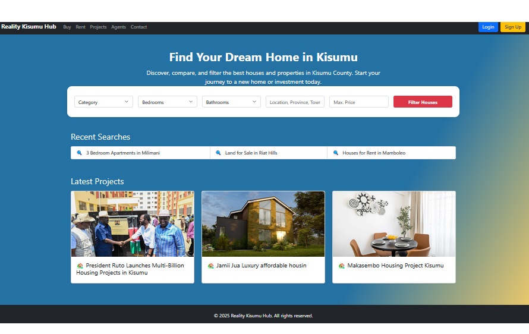
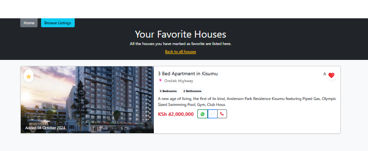

# 🏠 Real Estate Listing Platform

A web-based real estate platform built to explore **data-driven property ranking** and explainable, AI-inspired recommendation logic using structured listing data.

---

## 🚀 Overview

This project began as a static real estate website and was later evolved into a **data-driven platform** capable of ranking property listings based on user preferences.

Instead of relying on strict filters, the system evaluates how well each property matches a user’s criteria and **orders listings by relevance**, demonstrating a practical foundation for recommendation systems.

---

## ✨ Key Features

- Display property listings with essential details  
- Support multiple property types (apartments, houses, land, villas, etc.)  
- Simple user preference inputs (budget, location, property type)  
- **Smart property ranking using multi-signal scoring**
- Clean and explainable backend logic  

---

## 🧠 Smart Property Recommendation (What Was Implemented)

The platform includes a **content-based recommendation system** that ranks properties using a relevance score.

Each property is evaluated using:
- Price proximity to the user’s budget
- Location match
- Property type match
- Property size indicators (e.g., number of bedrooms)

Rather than filtering out non-matching properties, the system assigns each listing a score and **orders all results by relevance**.

This approach:
- Handles partial matches gracefully  
- Produces ranked results instead of binary outcomes  
- Keeps decision logic transparent and explainable  

> The recommendation logic is intentionally heuristic-based and designed as a stepping stone toward future machine learning–driven ranking models.

---

## 📸 Screenshots

### Property Listings – Default View
Shows property listings without intelligent ranking applied.


---

### Smart Property Ranking
Listings ordered based on relevance to user preferences.


---

### Index Page
Overview of the platform landing page.



---

### Favorites Page
Example of saved or starred property listings.



---

## ⚙️ Tech Stack

- **Frontend:** HTML, CSS, JavaScript  
- **Backend:** PHP  
- **Database:** MySQL  
- **Development Environment:** XAMPP  

---

## ⚙️ Setup

1. Clone the repository  
2. Create a MySQL database (e.g., `real_estate`)  
3. Import the provided SQL schema to create the properties table  
4. Configure database connection in the PHP configuration file  
5. Run the project using a local server (e.g., XAMPP)

---

## 🧪 Usage

- Browse available property listings  
- Enter basic preferences such as budget, location, and property type  
- View listings ranked by relevance rather than simple filtering  

---

## 🔮 Future Improvements

- User interaction tracking (views, favorites)
- Machine learning–based ranking models
- Price estimation and trend analysis
- Personalized recommendations based on user behavior

---

## 📌 Notes

This project prioritizes **clarity and explainability** over black-box automation.  
The goal is to demonstrate how intelligent behavior can emerge from structured data, weighted signals, and thoughtful system design.

---

## 📂 Project Structure (Simplified)

```text
├── listings.php
├── property.php
├── db.php
├── assets/
│   ├── css/
│   └── js/
├── screenshots/
│   ├── default-view.png
│   ├── smart-recommendation.png
│   └── property-details.png
└── sql/
    └── schema.sql
